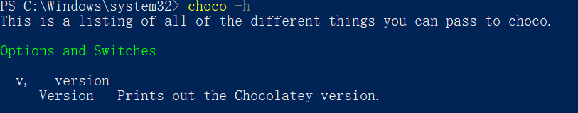

# 摘要

网站在我们的学习和科研工作中变得越来越重要，大如利用网站来管理自己的创业公司，小到用网站来宣传个人的工作成果等等。虽然制作网站需要各种各样的知识，如各种前后端语言、数据库的维护等，但是让人无法抵挡我们利用网站来实现一些非常创意的想法：如创建一个开放的科研分享论坛、分享自己刚刚被录用的工作等等。学习搭建网站，我在写下这段话的时候，其实对它的难度是有一定的心理预期的。但是一想到自己能利用搭建网站来实现自己的想法的时候，我还是觉得蛮兴奋的。因此我也肯在每天繁忙的科研生活中抽出一些深夜时间来提高自己的工程能力。希望读者也能知道自己想要做什么，然后跟我一起坚持学习下去。

目前，搭建网站基本都使用 Node.js 框架。我也是考虑到 Node.js 作为一个对新手友好、维护性高好、同时也有很多的学习资料的特性，所以决定以 Node.js 作为入口进行搭建。

-----
## 安装相应的工具

本系列的代码都在 Windows 10 上运行。

### Chocolately 安装

首先介绍一下 Chocolately。用 Ubuntu 进行科研工作的朋友应该对 apt-get 非常熟悉，它是一种 Linux 系统的软件管理器。只需要联网就可以让你的 Ubuntu 主机安装想要的软件。但是在 Windows 上安装软件还是得去网络上点击下周再安装，自动化程度非常低。因此 Chocolately 就是针对这个提出了一种和 Linux 系统类似的软件管理器。

安装方法非常简单，可以参考官网的步骤 <a href="https://chocolatey.org/install#individual"> Chocolately 官方网站安装</a>。需要注意的有以下几点：

+ 使用 Windows 系统的 Powershell 软件进行运行脚本。

``` powershell
Set-ExecutionPolicy Bypass -Scope Process -Force; [System.Net.ServicePointManager]::SecurityProtocol = [System.Net.ServicePointManager]::SecurityProtocol -bor 3072; iex ((New-Object System.Net.WebClient).DownloadString('https://community.chocolatey.org/install.ps1'))
```

+ 打开 Powershell 的时候记得赋予它管理员权限。
  
+ 安装好之后，输入 ```choco -h``` 看看有没有出现帮助页面。


<center> 图一：安装成功后输入帮助命令 </center>

### Node.js 的安装

Node.js 的安装包可以在这个网站进行下载：https://nodejs.org/en/download/，安装过程中需要注意的点有：

+ 记得要选择把 Node.js 的路径加到系统的 Path 路径下，这样你才可以在 CMD 上用 ```node``` 运行 Node.js 代码。
+ 详细的运行截图可以查看 [1]。

### NPM 的安装

安装好 Chocolately 之后，就可以利用 Chocolately 安装 Node.js 的包管理器 npm。

``` powershell
choco install nodejs       # 建议使用这种方法安装
cinst nodejs install
```

## 测试
要想测试下我们是否成功安装好了 Node.js，我们可以在自己的项目文件上新建一个 ```first_app.js```，在这个文件项目里写入以下代码：

```javascript 
var http = require('http');

http.createServer(function (req, res) {
    res.writeHead(200, {'Content-Type': 'text/html'});
    res.end('Hello World!');
}).listen(8080);
```
代码可以解释一下：```require("http")``` 是读入一个名叫 ```http``` 的模块，然后我们可以利用这个模块提供的功能（这个代码里面是创建一个服务器）。利用 ```http``` 模块快速建立一个网站后，我们让网站去监听 8080 端口。

要想运行这个服务器，我们需要在这个项目里，用 CMD 输入 ```node ./first_app.js```，然后打开浏览器输入 ```localhost:8080``` 就可以看到一个 hello world 的页面，这也表面我们的第一个简单的网站做好了。

下一次我们进一步学习如何使用 npm 和 搭建简单服务器。

## 引用
[1] How to Download & Install Node.js and NPM on Windows. https://www.guru99.com/download-install-node-js.html#2. 

